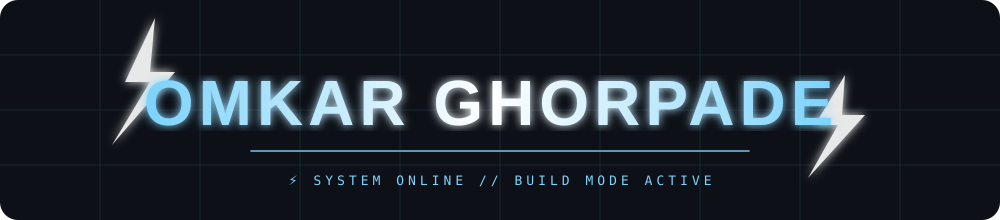
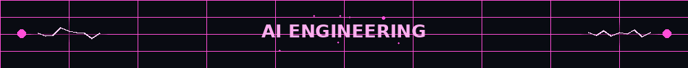
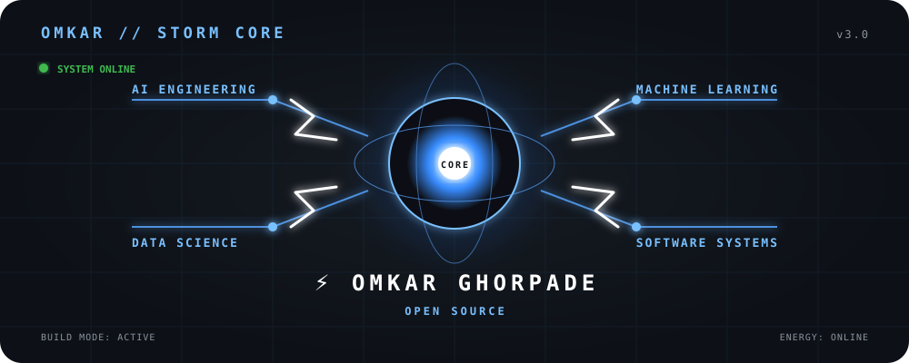

<div align="center">




**Building things that teach me how the world works.**

</div>

---

<div align="center">



</div>

---

## ⚡ OMKAR // ENGINEERING STATUS

<div align="center">

| 🤖 AI | 🧠 MACHINE LEARNING | ⚙️ SYSTEMS | 📊 DATA |
|:---:|:---:|:---:|:---:|
| BUILDING | LEARNING | EXPLORING | BUILDING |

</div>

---

## 🧠 ABOUT ME

I'm an AI & Data Science engineering student interested in understanding how intelligent software is built.

My interests include:

- Artificial Intelligence
- Machine Learning
- Data Science
- Software Engineering
- Backend & Systems
- Developer Tools
- Open Source

I learn by building, breaking things, understanding the failure, and improving the design.

---

## ⚡ WHAT I'M BUILDING

### 🛡️ SentinelOS

An experimental system-intelligence project exploring system behaviour, processes and AI-assisted software tooling.

**Status:** Building

### 🤖 Gyra

A personal AI assistant project exploring intelligence, automation, voice and software tools.

**Status:** Experimental / Building

### 📊 ML & Data Experiments

Small projects and experiments focused on:

`Machine Learning` `Data Processing` `Algorithms` `AI Systems`

**Status:** Continuous

---

## 🧰 TECH STACK

### Languages

`Python` `Go` `JavaScript` `TypeScript` `Java` `SQL`

### AI / Data

`Machine Learning` `NumPy` `Pandas` `Scikit-learn` `Data Analysis`

### Engineering

`Git` `GitHub` `Docker` `Linux` `VS Code`

### Exploring

`AI Systems` `Backend Engineering` `System Design` `Developer Tools` `Open Source`

---

## ⚙️ ENGINEERING PLAYGROUND

```text
                    ┌─────────────────┐
                    │      IDEA       │
                    └────────┬────────┘
                             ↓
                    ┌─────────────────┐
                    │      BUILD      │
                    └────────┬────────┘
                             ↓
                    ┌─────────────────┐
                    │      BREAK      │
                    └────────┬────────┘
                             ↓
                    ┌─────────────────┐
                    │    UNDERSTAND   │
                    └────────┬────────┘
                             ↓
                    ┌─────────────────┐
                    │     IMPROVE     │
                    └────────┬────────┘
                             ↓
                    ┌─────────────────┐
                    │      SHIP       │
                    └─────────────────┘
```
---

# 🎮 ⚡ STORM RUNNER

### MY CONTRIBUTION GRAPH — TURNED INTO AN ARCADE BATTLEFIELD


**Every contribution becomes part of the battlefield.**

---

## 🧭 CURRENT FOCUS

```text
AI ENGINEERING
      │
      ├── Machine Learning
      │
      ├── Data Science
      │
      ├── Software Systems
      │
      └── Developer Tools

🧠 ENGINEERING PHILOSOPHY

Build first.
Break things.
Understand the failure.
Improve the design.
Ship again.

I don't want to only learn how to use tools.

I want to understand what happens underneath them.

⚡ LONG-TERM DIRECTION
              AI
               │
               ↓
         INTELLIGENCE
               │
               ↓
            SYSTEMS
               │
               ↓
          AUTOMATION
               │
               ↓
             DATA
               │
               ↓
           SOFTWARE
               │
               ↓
        USEFUL SYSTEMS
```

Build software that is actually useful.

## 🌐 CONNECT

[](https://github.com/om-ghorpadeai)
[](https://www.linkedin.com/in/omkar-ghorpade-692278376/)

---

<div align="center">

### ⚡ BUILD → BREAK → UNDERSTAND → IMPROVE → SHIP

**Always building. Always learning.**

</div>
